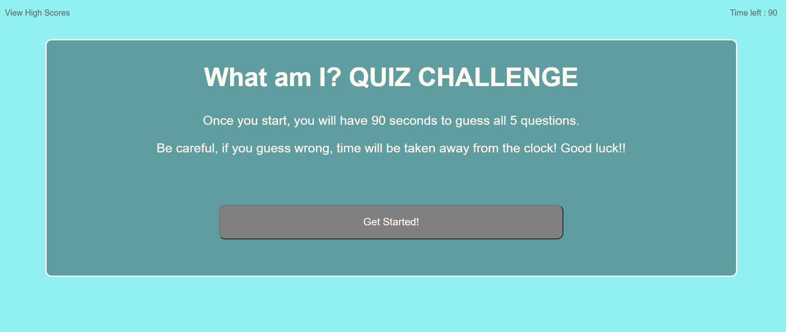
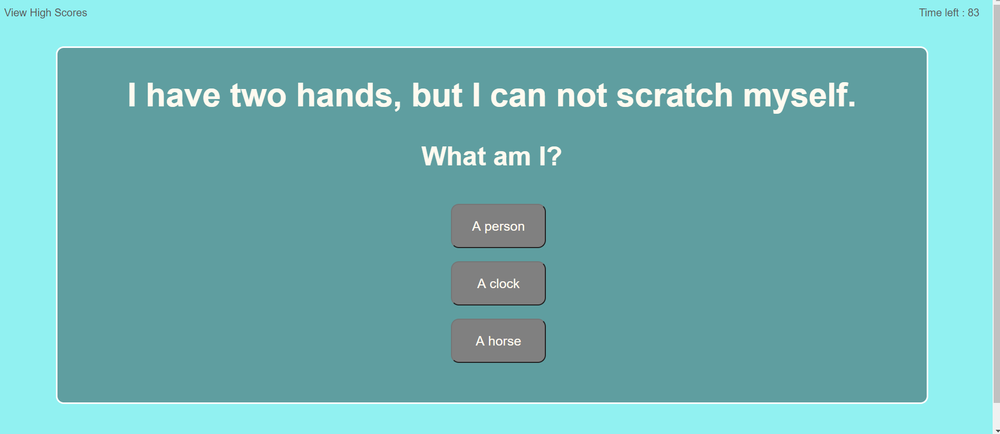
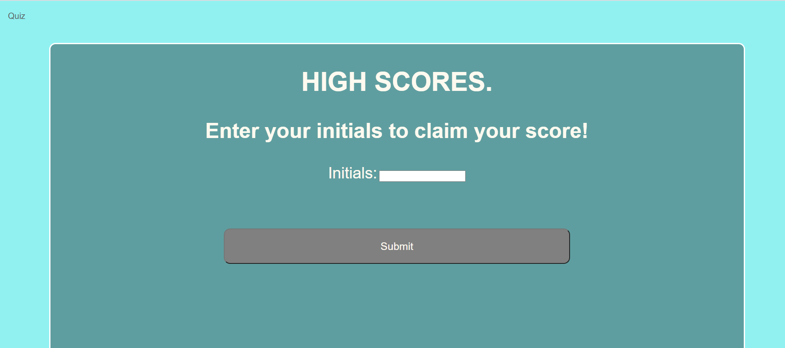

What Am I?

Here's a webpage that will ask you 5 multiple choice questions. It is a quiz! Once the quiz is completed, the user will have the chance to save their score. The score will equal the time it took the user to complete the quiz AND the user can take the quiz multiple times. Be careful though, if the user answers a question WRONG, their time will decrese and they will have less time to complete all questions. Once the user has acheived their score, they will be able to save their score.

https://cc22389.github.io/What-am-I/quiz.html

;
;
;

